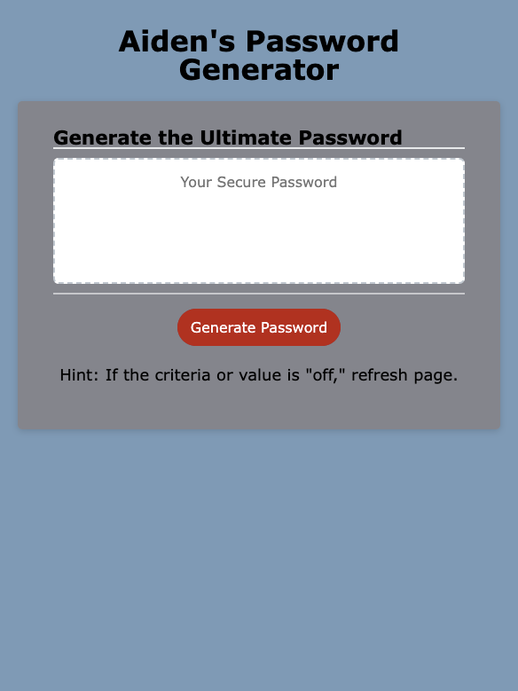

# Password Generator

## Description

The main goal of this project is to create create an application that enables employees to generate random passwords based on criteria that they’ve selected. This app will run in the browser and will feature dynamically updated HTML and CSS powered by JavaScript code. It will also have a clean and polished, responsive user interface that adapts to multiple screen sizes.
 
After completion of the project, I have a better understanding on declaring/calling variables, functions, if-statemtns, ternary operators and for loops. I also learned some better ways to write the JavaScript, thus making the code easier to read and more modular!

## Table of Contents

- [Installation](#installation)
- [Usage](#usage)
- [Credits](#credits)
- [License](#license)
- [Badges](#badges)
- [Features](#features)
- [Tests](#tests)
- [Links](#links)

## Installation

Chrome and/or Firefox are the preferred browsers to view to the program.
 
For the IDE, use Vs Code as well as the "Open with Live Server" Extension.

Steps Include:

- Install tools (Highly recommend an up to date web browser for JavaScript)
- Clone repository
- Pull to local sytem
- Create environment using extension

## Usage

Here's what the expected output should be:

## Links

Link to deployed application:
 
[logo]: https://prismhead26.github.io/passwordGenerator/ "Password Generator live application"
 
Link to HTML file:
 
[HTML](/index.html)
 
Link to CSS file:
 
[CSS](/assets/CSS/style.css)
 
Link to JavaScript file:
 
[CSS](/assets/Scripts/passwordGenerator.js)
 
Link to README file:
 
[README](/README.md)

## Credits

N/A

## License

Please refer to the LICENSE in the repo.

## Badges

 

 

## Features

JavaScript, variables, functions, if statements, ternary operators, DOM HTML, etc.
 
CSS, CSS Selectors, Media queries, resets, etc.
 
Basic HTML template with semantic elements.

## Tests

In order to test, run the program using the "Open with Live Server" Exstension.
 
I would also have DevTools open to see the logs.
 
Note: If the criteria and/or password is not generating properly, simply refresh the page.
 
There are also a few test logs in the console to help ensure the app is fully operable.
